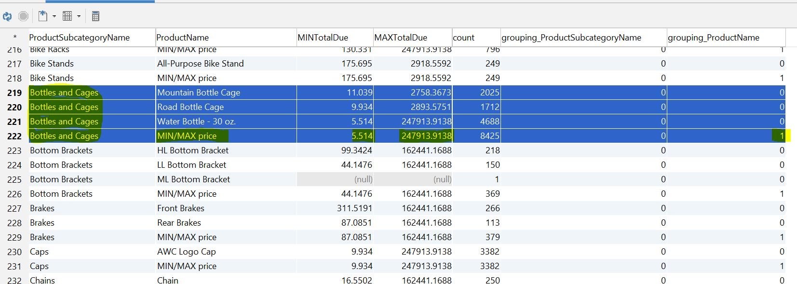

<h1 align="center">ДЗ 14</h1>
<h1 align="center">MySQL группировки с ипользованием CASE, HAVING, ROLLUP, GROUPING.</h1>

---
### Create database ###
```bash
1)
Скачать базу https://github.com/tapsey/AdventureWorksMYSQL
2)
mysql -u root -p AdventureWorks < AdventureWorks-MySQL-with-FKs.sql
```

### к списку продуктов добавить максимальную и минимальную цену и кол-во предложений ###
```sql
SELECT a.ProductID,
       a.Name AS ProductName,
       a.ProductNumber,
       d.ProductSubcategoryID,
       d.Name AS ProductSubcategoryName,
       SUM(c.SubTotal) AS SUMSubTotal,
       SUM(c.TotalDue) AS SUMTotalDue,
       MIN(c.TotalDue) AS MINTotalDue,
       MAX(c.TotalDue) AS MAXTotalDue,
       count(*) AS count FROM product a
LEFT JOIN salesorderdetail b
ON a.ProductID = b.Productid
LEFT JOIN salesorderheader c
ON b.SalesOrderID = c.SalesOrderID
LEFT JOIN productsubcategory d
ON a.ProductSubcategoryID = d.ProductSubcategoryID
GROUP BY a.ProductID,a.Name,a.ProductNumber,d.Name;
-- ProductSubcategoryName - категория продуктов
-- SUMSubTotal - общий промежуточный итог для конкретного продукта;
-- SUMTotalDue - общая сумма для конкретного продукта;
-- MINTotalDue - минимальная цена для конкретного продукта;
-- MAXTotalDue - максимальная цена для конкретного продукта;
-- count       - кол-во товаров конкретного продукта (кол-во предложений);
-- На сколько важно добавить поле d.ProductSubcategoryID в GROUP BY?
```

```sql
SELECT a.ProductID,
       a.Name AS ProductName,
       a.ProductNumber,
       d.ProductSubcategoryID,
       d.Name AS ProductSubcategoryName,
       SUM(c.SubTotal) AS SUMSubTotal,
       SUM(c.TotalDue) AS SUMTotalDue,
       MIN(c.TotalDue) AS MINTotalDue,
       MAX(c.TotalDue) AS MAXTotalDue,
       count(*) AS count FROM product a
LEFT JOIN salesorderdetail b
ON a.ProductID = b.Productid
LEFT JOIN salesorderheader c
ON b.SalesOrderID = c.SalesOrderID
LEFT JOIN productsubcategory d
ON a.ProductSubcategoryID = d.ProductSubcategoryID
GROUP BY a.ProductID,a.Name,a.ProductNumber,d.Name
HAVING ProductSubcategoryName IN ('Helmets','Jerseys','Socks');
-- Выводим информацию только для продуктов категорий 'Helmets','Jerseys','Socks'
```

### Выборка показывающая самый дорогой и самый дешевый товар (их цену)в каждой категории сделать rollup с количеством товаров по категориям ###
```sql
SELECT d.Name AS ProductSubcategoryName,
       CASE
         WHEN (GROUPING(a.Name)=1) THEN 'MIN/MAX price'
         ELSE a.Name
       END AS ProductName,
       MIN(c.TotalDue) AS MINTotalDue,
       MAX(c.TotalDue) AS MAXTotalDue,
       count(*) AS count,
       GROUPING(d.Name) AS grouping_ProductSubcategoryName,
       GROUPING(a.Name) AS grouping_ProductName
       FROM product a
LEFT JOIN salesorderdetail b
ON a.ProductID = b.Productid
LEFT JOIN salesorderheader c
ON b.SalesOrderID = c.SalesOrderID
LEFT JOIN productsubcategory d
ON a.ProductSubcategoryID = d.ProductSubcategoryID
GROUP BY d.Name,a.Name WITH ROLLUP;
```



| Database   | ver    |
| -----      | ---    |
| MySQL      | 8.0.15 |
